# Cognitive Urban Twin — Complete Mermaid Figure Pack v1.0

**Status:** Reconstructed authoritative source from the verified publication figures and ontology traceability artefacts.  
**Scope:** Figures 4.1–4.8.  
**Design principle:** The ontology / Cognitive Twin Knowledge Core is treated as the semantic single source of truth across architecture, reasoning, dependency analysis, decision support, feedback and adaptation.

> Mermaid rendering can vary slightly between Mermaid versions. The source below uses standard Mermaid flowchart, classDiagram and sequenceDiagram syntax and avoids non-portable extensions where possible.

---

## Shared visual convention

The figures use a common semantic colour mapping:

- Blue — Hazard, weather, external context
- Green — Forecast and impact assessment
- Purple — Cognitive Twin Knowledge Core
- Orange — Data centre capability
- Teal — Urban service capability
- Gold — Cross-domain dependency
- Dark green — Decision, feedback and resilience

---

# Figure 4.1 — Cognitive Urban Twin Architecture

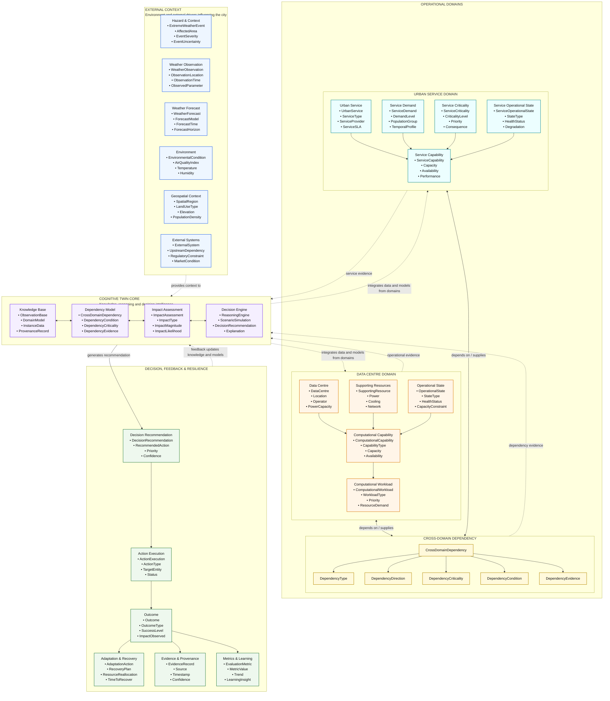

---

# Figure 4.2 — Ontology Development Workflow for the Cognitive Urban Twin

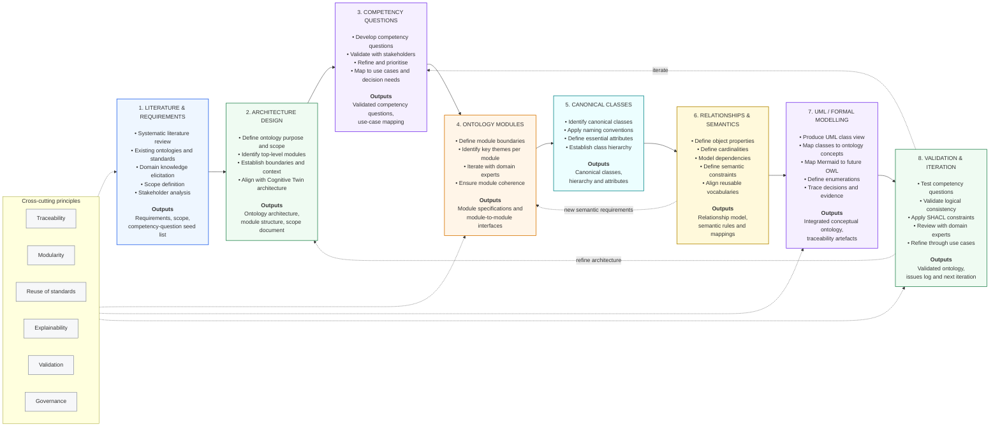

---

# Figure 4.3 — Conceptual Ontology Modules for the Cognitive Urban Twin

```mermaid
flowchart TB

subgraph M1["1. HAZARD & CONTEXT<br/>Represents environmental conditions and hazard events affecting the city."]
direction TB
M1A["WeatherForecast"]
M1B["WeatherObservation"]
M1C["ExtremeWeatherEvent"]
M1D["AffectedArea"]
M1E["EventSeverity"]
M1F["EventUncertainty"]
end

subgraph M2["2. FORECAST & IMPACT ASSESSMENT<br/>Models forecasting outputs and assesses potential impacts and risks."]
direction TB
M2A["ForecastModel"]
M2B["ImpactAssessment"]
M2C["PredictedImpact"]
M2D["RiskLevel"]
M2E["ConfidenceAssessment"]
M2F["AssessmentEvidence"]
end

subgraph M3["3. COGNITIVE TWIN KNOWLEDGE CORE<br/>Central knowledge and reasoning layer integrating data, dependencies, impacts and decisions."]
direction TB
M3A["ObservationBase"]
M3B["KnowledgeBase"]
M3C["CrossDomainDependency"]
M3D["DependencyModel"]
M3E["ImpactReasoning"]
M3F["DecisionEngine"]
M3G["DecisionRecommendation"]
M3H["Scenario"]
M3I["Explanation"]
end

subgraph M4["4. DATA CENTRE CAPABILITY<br/>Captures data-centre assets, capabilities, state and workloads."]
direction TB
M4A["DataCentre"]
M4B["OperationalState"]
M4C["ComputationalCapability"]
M4D["ComputationalWorkload"]
M4E["SupportingResource"]
M4F["InfrastructureComponent"]
M4G["CapacityConstraint"]
end

subgraph M5["5. URBAN SERVICE CAPABILITY<br/>Represents critical urban services, capability, demand and operational state."]
direction TB
M5A["UrbanService"]
M5B["ServiceCapability"]
M5C["ServiceOperationalState"]
M5D["ServiceDemand"]
M5E["ServiceCriticality"]
M5F["PopulationGroup"]
M5G["ServiceDependency"]
M5H["ServiceProvider"]
M5I["ServiceSLA"]
end

subgraph M6["6. CROSS-DOMAIN DEPENDENCY<br/>Represents dependencies linking infrastructure and services across domains."]
direction TB
M6A["CrossDomainDependency"]
M6B["DependencyType"]
M6C["DependencyDirection"]
M6D["DependencyCriticality"]
M6E["DependencyCondition"]
M6F["DependencyEvidence"]
M6G["PropagationPath"]
end

subgraph M7["7. DECISION, FEEDBACK & RESILIENCE<br/>Represents recommendations, actions, outcomes, provenance and learning."]
direction TB
M7A["DecisionRecommendation"]
M7B["ActionExecution"]
M7C["ActionOutcome"]
M7D["AdaptationAction"]
M7E["RecoveryPlan"]
M7F["EvidenceRecord"]
M7G["ProvenanceRecord"]
M7H["EvaluationMetric"]
M7I["LearningInsight"]
end

M1 -. "context" .-> M2
M1 -. "observations" .-> M3
M2 -. "assessments" .-> M3
M4 -. "capability state" .-> M3
M5 -. "service state" .-> M3
M4 --> M6
M5 --> M6
M6 -. "dependency model" .-> M3
M3 -->|"recommendations"| M7
M7 -. "feedback / learning" .-> M3

classDef blue fill:#eef6ff,stroke:#2563eb,stroke-width:1.5px;
classDef green fill:#effbf2,stroke:#2e8b57,stroke-width:1.5px;
classDef purple fill:#f5efff,stroke:#7c3aed,stroke-width:1.5px;
classDef orange fill:#fff5e8,stroke:#d97706,stroke-width:1.5px;
classDef teal fill:#ecfeff,stroke:#0f8b8d,stroke-width:1.5px;
classDef gold fill:#fff9db,stroke:#b58900,stroke-width:1.5px;
classDef darkgreen fill:#eef8ee,stroke:#287a3d,stroke-width:1.5px;

class M1A,M1B,M1C,M1D,M1E,M1F blue;
class M2A,M2B,M2C,M2D,M2E,M2F green;
class M3A,M3B,M3C,M3D,M3E,M3F,M3G,M3H,M3I purple;
class M4A,M4B,M4C,M4D,M4E,M4F,M4G orange;
class M5A,M5B,M5C,M5D,M5E,M5F,M5G,M5H,M5I teal;
class M6A,M6B,M6C,M6D,M6E,M6F,M6G gold;
class M7A,M7B,M7C,M7D,M7E,M7F,M7G,M7H,M7I darkgreen;
```

---

# Figure 4.4 — Integrated Conceptual Ontology for the Cognitive Urban Twin
## UML Class View with Canonical Relationships

```mermaid
classDiagram

%% ============================================================
%% MODULE 1 — HAZARD & CONTEXT
%% ============================================================

class WeatherForecast {
  +DateTime forecastTime
  +Duration forecastHorizon
  +String resolution
  +String source
}

class WeatherObservation {
  +DateTime observationTime
  +String parameter
  +Decimal value
  +String source
}

class ExtremeWeatherEvent {
  +String eventType
  +DateTime startTime
  +DateTime endTime
  +String description
}

class EventSeverity {
  +SeverityLevel level
  +Decimal intensity
  +Decimal confidence
}

class AffectedArea {
  +Geometry geometry
  +AreaType areaType
  +String location
}

class EventUncertainty {
  +String uncertaintyType
  +Decimal value
  +String method
}

WeatherForecast --> ExtremeWeatherEvent : predicts
WeatherObservation --> ExtremeWeatherEvent : observes
ExtremeWeatherEvent --> AffectedArea : occursIn
ExtremeWeatherEvent --> EventSeverity : hasSeverity
ExtremeWeatherEvent --> EventUncertainty : hasUncertainty

%% ============================================================
%% MODULE 2 — FORECAST & IMPACT ASSESSMENT
%% ============================================================

class ForecastModel {
  +ModelType modelType
  +Duration horizon
  +String resolution
  +Duration updateFrequency
}

class ImpactAssessment {
  +DateTime assessmentTime
  +String scenario
  +String method
  +RiskLevel overallRisk
}

class PredictedImpact {
  +ImpactType impactType
  +Decimal magnitude
  +Decimal probability
  +String unit
}

class RiskAssessmentLevel {
  +RiskLevel level
  +Decimal score
  +Decimal confidence
}

class ConfidenceAssessment {
  +Decimal confidence
  +String method
  +String evidenceBasis
}

class AssessmentEvidence {
  +String evidenceId
  +String source
  +DateTime timestamp
  +Decimal confidence
}

ForecastModel --> ImpactAssessment : generates
ImpactAssessment --> PredictedImpact : produces
ImpactAssessment --> RiskAssessmentLevel : determines
ImpactAssessment --> ConfidenceAssessment : estimates
PredictedImpact --> AssessmentEvidence : supportedBy
RiskAssessmentLevel --> AssessmentEvidence : supportedBy
ConfidenceAssessment --> AssessmentEvidence : supportedBy
ExtremeWeatherEvent --> ImpactAssessment : affects

%% ============================================================
%% MODULE 3 — COGNITIVE TWIN KNOWLEDGE CORE
%% ============================================================

class ObservationBase {
  +String observationId
  +DateTime time
  +String source
  +QualityLevel quality
}

class KnowledgeBase {
  +String knowledgeBaseId
  +String version
  +DateTime updatedAt
}

class DependencyModel {
  +String modelId
  +String modelType
  +String version
}

class ImpactReasoning {
  +String reasoningId
  +String ruleSet
  +DateTime executedAt
}

class DecisionEngine {
  +String engineId
  +String engineType
  +String version
}

class DecisionRecommendation {
  +String recommendationId
  +String recommendation
  +PriorityLevel priority
  +Decimal confidence
}

class Scenario {
  +String scenarioId
  +String name
  +String description
  +DateTime createdAt
}

class Explanation {
  +String explanationId
  +String rationale
  +String evidenceSummary
  +Decimal confidence
}

KnowledgeBase o-- ObservationBase : contains
KnowledgeBase o-- DependencyModel : contains
KnowledgeBase o-- Scenario : contains
ImpactAssessment --> KnowledgeBase : updates
DependencyModel --> ImpactReasoning : informs
ImpactReasoning --> DecisionEngine : suppliesInference
DecisionEngine --> DecisionRecommendation : generates
DecisionRecommendation --> Explanation : explainedBy
Scenario --> ImpactReasoning : evaluatedBy

%% ============================================================
%% MODULE 4 — DATA CENTRE CAPABILITY
%% ============================================================

class DataCentre {
  +String dataCentreId
  +String name
  +String location
  +String operator
}

class ComputationalCapability {
  +String capabilityId
  +String capabilityType
  +Decimal capacity
  +Decimal availability
}

class ComputationalWorkload {
  +String workloadId
  +WorkloadType workloadType
  +PriorityLevel priority
  +Decimal resourceDemand
}

class OperationalState {
  +String stateId
  +OperationalStateType stateType
  +Decimal availability
  +DateTime timestamp
}

class SupportingResource {
  +String resourceId
  +ResourceType resourceType
  +Decimal capacity
  +Decimal availability
}

class InfrastructureComponent {
  +String componentId
  +String componentType
  +String status
}

class CapacityConstraint {
  +String constraintId
  +String constraintType
  +Decimal threshold
  +String unit
}

DataCentre *-- InfrastructureComponent : comprises
DataCentre o-- ComputationalCapability : provides
DataCentre o-- SupportingResource : uses
ComputationalCapability --> ComputationalWorkload : supports
DataCentre --> OperationalState : hasState
ComputationalCapability --> CapacityConstraint : constrainedBy
SupportingResource --> CapacityConstraint : constrainedBy

%% ============================================================
%% MODULE 5 — URBAN SERVICE CAPABILITY
%% ============================================================

class UrbanService {
  +String serviceId
  +String serviceType
  +String name
}

class ServiceCapability {
  +String capabilityId
  +Decimal capacity
  +Decimal availability
  +Decimal performance
}

class ServiceOperationalState {
  +String stateId
  +OperationalStateType stateType
  +Decimal degradation
  +DateTime timestamp
}

class ServiceDemand {
  +String demandId
  +Decimal demandLevel
  +String temporalProfile
}

class ServiceCriticality {
  +CriticalityLevel criticality
  +PriorityLevel priority
  +String consequence
}

class PopulationGroup {
  +String populationGroupId
  +String description
  +Decimal populationSize
}

class ServiceDependency {
  +String dependencyId
  +DependencyType dependencyType
  +CriticalityLevel criticality
}

class ServiceProvider {
  +String providerId
  +String name
  +String organisationType
}

class ServiceSLA {
  +String slaId
  +Decimal availabilityTarget
  +Duration responseTarget
}

UrbanService o-- ServiceCapability : provides
UrbanService --> ServiceOperationalState : hasState
UrbanService --> ServiceDemand : experiences
UrbanService --> ServiceCriticality : hasCriticality
ServiceDemand --> PopulationGroup : relatesTo
UrbanService --> ServiceDependency : hasDependency
ServiceProvider --> UrbanService : operates
UrbanService --> ServiceSLA : governedBy

%% ============================================================
%% MODULE 6 — CROSS-DOMAIN DEPENDENCY
%% ============================================================

class CrossDomainDependency {
  +String dependencyId
  +DependencyType dependencyType
  +DependencyDirection direction
  +CriticalityLevel criticality
}

class DependencyCondition {
  +String conditionId
  +String expression
  +Decimal threshold
}

class DependencyEvidence {
  +String evidenceId
  +String evidenceType
  +String source
  +Decimal confidence
}

class PropagationPath {
  +String pathId
  +Integer hopCount
  +Decimal propagationConfidence
}

DataCentre --> CrossDomainDependency : participatesIn
UrbanService --> CrossDomainDependency : participatesIn
CrossDomainDependency --> DependencyCondition : activatedBy
CrossDomainDependency --> DependencyEvidence : supportedBy
CrossDomainDependency --> PropagationPath : propagatesVia
CrossDomainDependency --> DependencyModel : representedIn

%% ============================================================
%% MODULE 7 — DECISION, FEEDBACK & RESILIENCE
%% ============================================================

class ActionExecution {
  +String executionId
  +ActionType actionType
  +ExecutionStatus status
  +DateTime startTime
  +DateTime endTime
}

class ActionOutcome {
  +String outcomeId
  +String result
  +Boolean success
  +Decimal impact
}

class AdaptationAction {
  +String actionId
  +ActionType actionType
  +PriorityLevel priority
}

class RecoveryPlan {
  +String recoveryPlanId
  +String objective
  +Duration targetRecoveryTime
}

class EvidenceRecord {
  +String evidenceId
  +EvidenceType evidenceType
  +String source
  +QualityLevel quality
}

class ProvenanceRecord {
  +String recordId
  +DateTime generatedAt
  +String generatedBy
  +String method
}

class EvaluationMetric {
  +String metricId
  +MetricType metricType
  +Decimal value
  +String unit
}

class LearningInsight {
  +String insightId
  +String finding
  +Decimal confidence
}

DecisionRecommendation --> ActionExecution : authorises
ActionExecution --> ActionOutcome : produces
ActionOutcome --> AdaptationAction : triggers
AdaptationAction --> RecoveryPlan : contributesTo
ActionOutcome --> EvidenceRecord : evidencedBy
EvidenceRecord --> ProvenanceRecord : hasProvenance
ActionOutcome --> EvaluationMetric : evaluatedBy
EvaluationMetric --> LearningInsight : generates
LearningInsight --> KnowledgeBase : updates

%% ============================================================
%% CROSS-MODULE RELATIONSHIPS
%% ============================================================

WeatherObservation --> ObservationBase : contributesTo
WeatherForecast --> ForecastModel : generatedBy
AssessmentEvidence --> EvidenceRecord : becomes
OperationalState --> ObservationBase : contributesTo
ServiceOperationalState --> ObservationBase : contributesTo
ComputationalCapability --> DependencyModel : representedIn
ServiceCapability --> DependencyModel : representedIn
DecisionRecommendation --> EvidenceRecord : justifiedBy
Explanation --> EvidenceRecord : references

%% ============================================================
%% ENUMERATIONS / CONTROLLED VOCABULARIES
%% ============================================================

class SeverityLevel {
  <<enumeration>>
  Low
  Medium
  High
  Critical
}

class AreaType {
  <<enumeration>>
  Point
  Line
  Polygon
  Region
}

class ModelType {
  <<enumeration>>
  Weather
  DataCentre
  Service
  CrossDomain
}

class RiskLevel {
  <<enumeration>>
  Low
  Medium
  High
  VeryHigh
  Extreme
}

class WorkloadType {
  <<enumeration>>
  HPC
  AI_ML
  Analytics
  Storage
  Inference
  Batch
}

class OperationalStateType {
  <<enumeration>>
  Operational
  Degraded
  PartialOutage
  Outage
  Maintenance
}

class DependencyType {
  <<enumeration>>
  Power
  Cooling
  Network
  Data
  Service
  Logistical
  Regulatory
}

class DependencyDirection {
  <<enumeration>>
  Upstream
  Downstream
  Bidirectional
}

class ActionType {
  <<enumeration>>
  WorkloadShift
  LoadShedding
  CoolingAdjust
  BatteryDispatch
  TrafficReroute
  PublicAlert
  ResourceAllocate
  Other
}

class ExecutionStatus {
  <<enumeration>>
  Planned
  InProgress
  Completed
  Failed
  Cancelled
}

class DomainType {
  <<enumeration>>
  DataCentre
  UrbanService
}

class PriorityLevel {
  <<enumeration>>
  Low
  Medium
  High
  Critical
}

class CriticalityLevel {
  <<enumeration>>
  Low
  Medium
  High
  Critical
}

class EvidenceType {
  <<enumeration>>
  Observation
  Forecast
  ModelOutput
  OperatorReport
  SensorData
  Other
}

class MetricType {
  <<enumeration>>
  Availability
  ResponseTime
  Throughput
  Risk
  Cost
  Other
}

class QualityLevel {
  <<enumeration>>
  High
  Medium
  Low
  Unknown
}

class ResourceType {
  <<enumeration>>
  Power
  Cooling
  Network
  Storage
  Compute
  Other
}
```

---

# Figure 4.5 — Semantic Relationship Model Across the Cognitive Urban Twin Ontology

```mermaid
flowchart TB

%% HAZARD & CONTEXT
subgraph H["1. HAZARD & CONTEXT"]
direction TB
WF["WeatherForecast"]
WO["WeatherObservation"]
EWE["ExtremeWeatherEvent"]
AA["AffectedArea"]
ES["EventSeverity"]
EU["EventUncertainty"]

WF <-->|"refines 0..*"| WO
WF -->|"predicts 1..*"| EWE
WO -->|"observes 1..*"| EWE
EWE -->|"occursIn 1..*"| AA
EWE -->|"hasSeverity 1"| ES
EWE -->|"hasUncertainty 0..1"| EU
end

%% FORECAST & IMPACT
subgraph F["2. FORECAST & IMPACT ASSESSMENT"]
direction TB
FM["ForecastModel"]
IA["ImpactAssessment"]
PI["PredictedImpact"]
RL["RiskLevel"]
CA["ConfidenceAssessment"]
AE["AssessmentEvidence"]

FM -->|"generates 1..*"| IA
IA -->|"produces 1..*"| PI
IA -->|"determines 1"| RL
IA -->|"estimates 1"| CA
PI -->|"supportedBy 1..*"| AE
RL -->|"supportedBy 1..*"| AE
CA -->|"supportedBy 1..*"| AE
end

%% DATA CENTRE
subgraph D["4. DATA CENTRE CAPABILITY"]
direction TB
DC["DataCentre"]
CC["ComputationalCapability"]
CW["ComputationalWorkload"]
OS["OperationalState"]
SR["SupportingResource"]
IC["InfrastructureComponent"]
CT["CapacityConstraint"]

DC -->|"provides 1..*"| CC
CC -->|"supports 0..*"| CW
DC -->|"hasState 1"| OS
DC -->|"uses 1..*"| SR
DC -->|"comprises 1..*"| IC
CC -->|"constrainedBy 0..*"| CT
end

%% URBAN SERVICE
subgraph U["5. URBAN SERVICE CAPABILITY"]
direction TB
US["UrbanService"]
SC["ServiceCapability"]
SOS["ServiceOperationalState"]
SD["ServiceDemand"]
SCT["ServiceCriticality"]
PG["PopulationGroup"]
SDEP["ServiceDependency"]
SP["ServiceProvider"]
SLA["ServiceSLA"]

US -->|"provides 1..*"| SC
US -->|"hasState 1"| SOS
US -->|"experiences 0..*"| SD
US -->|"hasCriticality 1"| SCT
SD -->|"relatesTo 1..*"| PG
US -->|"hasDependency 0..*"| SDEP
SP -->|"operates 1..*"| US
US -->|"governedBy 0..1"| SLA
end

%% CROSS DOMAIN
subgraph X["6. CROSS-DOMAIN DEPENDENCY"]
direction TB
CDD["CrossDomainDependency"]
DCON["DependencyCondition"]
DEVID["DependencyEvidence"]
PP["PropagationPath"]

CDD -->|"activatedBy 0..*"| DCON
CDD -->|"supportedBy 1..*"| DEVID
CDD -->|"propagatesVia 0..*"| PP
end

%% CORE
subgraph C["3. COGNITIVE TWIN KNOWLEDGE CORE"]
direction TB
OB["ObservationBase"]
KB["KnowledgeBase"]
DM["DependencyModel"]
IR["ImpactReasoning"]
DE["DecisionEngine"]
DR["DecisionRecommendation"]
SCEN["Scenario"]
EXP["Explanation"]

KB o--|"contains 0..*"| OB
KB o--|"contains 0..*"| DM
KB o--|"contains 0..*"| SCEN
DM -->|"informs"| IR
SCEN -->|"evaluatedBy"| IR
IR -->|"suppliesInference"| DE
DE -->|"generates 1..*"| DR
DR -->|"explainedBy 1"| EXP
end

%% DECISION / FEEDBACK
subgraph R["7. DECISION, FEEDBACK & RESILIENCE"]
direction TB
AX["ActionExecution"]
AO["ActionOutcome"]
ADA["AdaptationAction"]
RP["RecoveryPlan"]
ER["EvidenceRecord"]
PR["ProvenanceRecord"]
EM["EvaluationMetric"]
LI["LearningInsight"]

AX -->|"produces 1"| AO
AO -->|"triggers 0..*"| ADA
ADA -->|"contributesTo 0..*"| RP
AO -->|"evidencedBy 1..*"| ER
ER -->|"hasProvenance 1"| PR
AO -->|"evaluatedBy 1..*"| EM
EM -->|"generates 0..*"| LI
end

H -->|"drives"| F
F -->|"updates / informs"| C
D -->|"provides capability evidence"| C
U -->|"provides service evidence"| C

DC -->|"participatesIn"| CDD
US -->|"participatesIn"| CDD
CDD -->|"representedIn"| DM

DR -->|"authorises"| AX
DR -->|"justifiedBy"| ER
LI -. "feedback updates knowledge" .-> KB

WF -. "reasoning / inference flow" .-> C
OS -. "observation" .-> OB
SOS -. "observation" .-> OB

classDef blue fill:#eef6ff,stroke:#2563eb,stroke-width:1.5px;
classDef green fill:#effbf2,stroke:#2e8b57,stroke-width:1.5px;
classDef purple fill:#f5efff,stroke:#7c3aed,stroke-width:1.5px;
classDef orange fill:#fff5e8,stroke:#d97706,stroke-width:1.5px;
classDef teal fill:#ecfeff,stroke:#0f8b8d,stroke-width:1.5px;
classDef gold fill:#fff9db,stroke:#b58900,stroke-width:1.5px;
classDef darkgreen fill:#eef8ee,stroke:#287a3d,stroke-width:1.5px;

class WF,WO,EWE,AA,ES,EU blue;
class FM,IA,PI,RL,CA,AE green;
class DC,CC,CW,OS,SR,IC,CT orange;
class US,SC,SOS,SD,SCT,PG,SDEP,SP,SLA teal;
class CDD,DCON,DEVID,PP gold;
class OB,KB,DM,IR,DE,DR,SCEN,EXP purple;
class AX,AO,ADA,RP,ER,PR,EM,LI darkgreen;
```

---

# Figure 4.6 — Cognitive Reasoning & Decision Sequence in the Cognitive Urban Twin

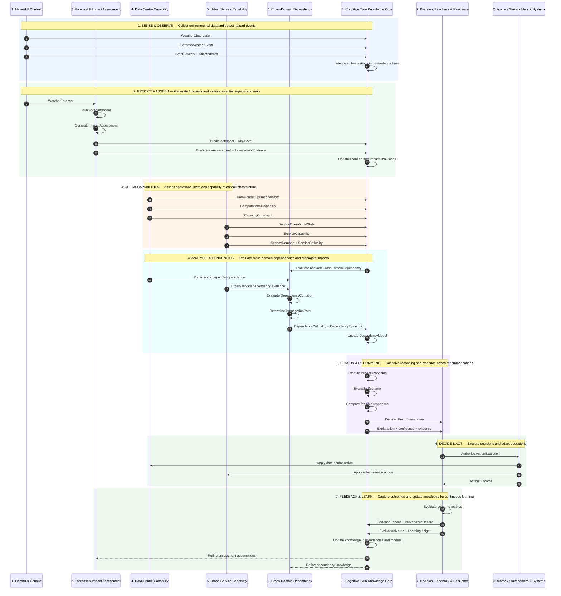

---

# Figure 4.7 — Canonical Class Overview of the Cognitive Urban Twin Ontology

```mermaid
flowchart LR

subgraph M1["1. HAZARD & CONTEXT<br/>Environmental conditions and external drivers"]
direction TB
A1["WeatherForecast<br/>(Prediction)"]
A2["WeatherObservation<br/>(Observation)"]
A3["ExtremeWeatherEvent<br/>(Event)"]
A4["EnvironmentalCondition<br/>(Condition)"]
A5["Area<br/>(SpatialEntity)"]
A6["SeverityLevel<br/>(Severity)"]
A7["UncertaintyEstimate<br/>(Metadata)"]
end

subgraph M2["2. FORECAST & IMPACT ASSESSMENT<br/>Models, predictions and impact assessment"]
direction TB
B1["ForecastModel<br/>(Model)"]
B2["ImpactAssessment<br/>(Assessment)"]
B3["PredictedImpact<br/>(Impact)"]
B4["RiskLevel<br/>(Risk)"]
B5["ConfidenceAssessment<br/>(Confidence)"]
B6["AssessmentEvidence<br/>(Evidence)"]
end

subgraph M3["3. COGNITIVE TWIN KNOWLEDGE CORE<br/>Cognitive reasoning and knowledge management"]
direction TB
C1["ObservationBase<br/>(KnowledgeResource)"]
C2["KnowledgeBase<br/>(KnowledgeResource)"]
C3["DependencyModel<br/>(Model)"]
C4["ImpactReasoning<br/>(Reasoning)"]
C5["DecisionEngine<br/>(ReasoningEngine)"]
C6["DecisionRecommendation<br/>(Recommendation)"]
C7["Scenario<br/>(Scenario)"]
C8["Explanation<br/>(Explanation)"]
end

subgraph M4["4. DATA CENTRE CAPABILITY<br/>Assets, capabilities and operational state"]
direction TB
D1["DataCentre<br/>(Asset)"]
D2["ComputationalCapability<br/>(Capability)"]
D3["ComputationalWorkload<br/>(Workload)"]
D4["OperationalState<br/>(State)"]
D5["SupportingResource<br/>(Resource)"]
D6["InfrastructureComponent<br/>(Component)"]
D7["CapacityConstraint<br/>(Constraint)"]
end

subgraph M5["5. URBAN SERVICE CAPABILITY<br/>Critical services, demand and operational state"]
direction TB
E1["UrbanService<br/>(Service)"]
E2["ServiceCapability<br/>(Capability)"]
E3["ServiceOperationalState<br/>(State)"]
E4["ServiceDemand<br/>(Demand)"]
E5["ServiceCriticality<br/>(Criticality)"]
E6["PopulationGroup<br/>(Population)"]
E7["ServiceDependency<br/>(Dependency)"]
E8["ServiceProvider<br/>(Organisation)"]
E9["ServiceSLA<br/>(Agreement)"]
end

subgraph M6["6. CROSS-DOMAIN DEPENDENCY<br/>Interdependencies and propagation"]
direction TB
F1["CrossDomainDependency<br/>(Dependency)"]
F2["DependencyType<br/>(Classification)"]
F3["DependencyDirection<br/>(Direction)"]
F4["DependencyCriticality<br/>(Criticality)"]
F5["DependencyCondition<br/>(Condition)"]
F6["DependencyEvidence<br/>(Evidence)"]
F7["PropagationPath<br/>(Path)"]
end

subgraph M7["7. DECISION, FEEDBACK & RESILIENCE<br/>Actions, outcomes, provenance and learning"]
direction TB
G1["DecisionRecommendation<br/>(Recommendation)"]
G2["ActionExecution<br/>(Action)"]
G3["ActionOutcome<br/>(Outcome)"]
G4["AdaptationAction<br/>(Action)"]
G5["RecoveryPlan<br/>(Plan)"]
G6["EvidenceRecord<br/>(Evidence)"]
G7["ProvenanceRecord<br/>(Provenance)"]
G8["EvaluationMetric<br/>(Metric)"]
G9["LearningInsight<br/>(Learning)"]
end

M1 --> M2
M2 --> M3
M4 --> M3
M5 --> M3
M4 --> M6
M5 --> M6
M6 --> M3
M3 --> M7
M7 -.-> M3

classDef blue fill:#eef6ff,stroke:#2563eb,stroke-width:1.5px;
classDef green fill:#effbf2,stroke:#2e8b57,stroke-width:1.5px;
classDef purple fill:#f5efff,stroke:#7c3aed,stroke-width:1.5px;
classDef orange fill:#fff5e8,stroke:#d97706,stroke-width:1.5px;
classDef teal fill:#ecfeff,stroke:#0f8b8d,stroke-width:1.5px;
classDef gold fill:#fff9db,stroke:#b58900,stroke-width:1.5px;
classDef darkgreen fill:#eef8ee,stroke:#287a3d,stroke-width:1.5px;

class A1,A2,A3,A4,A5,A6,A7 blue;
class B1,B2,B3,B4,B5,B6 green;
class C1,C2,C3,C4,C5,C6,C7,C8 purple;
class D1,D2,D3,D4,D5,D6,D7 orange;
class E1,E2,E3,E4,E5,E6,E7,E8,E9 teal;
class F1,F2,F3,F4,F5,F6,F7 gold;
class G1,G2,G3,G4,G5,G6,G7,G8,G9 darkgreen;
```

---

# Figure 4.8 — Ontology Maturity Model for the Cognitive Urban Twin

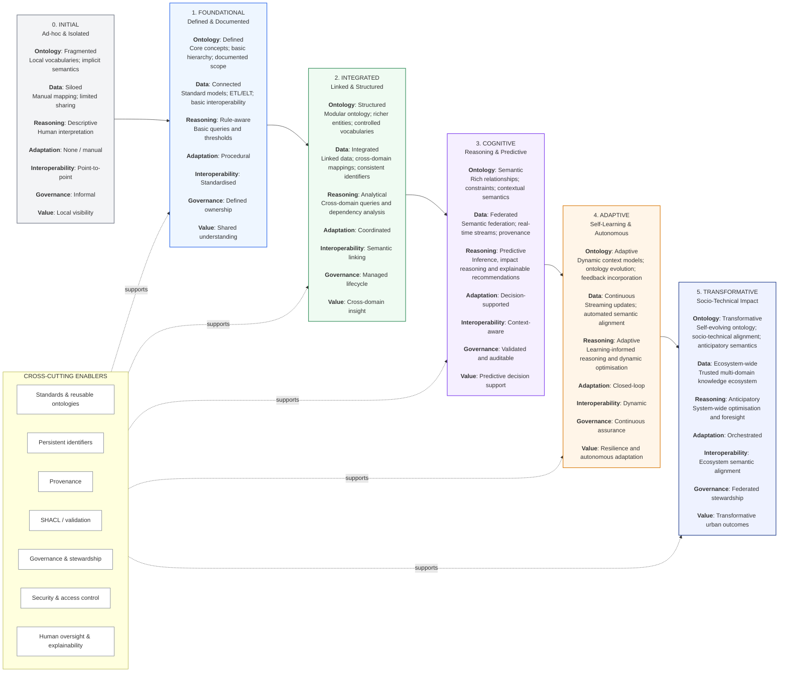

---

# Supplementary Figure S1 — Ontology Package Structure

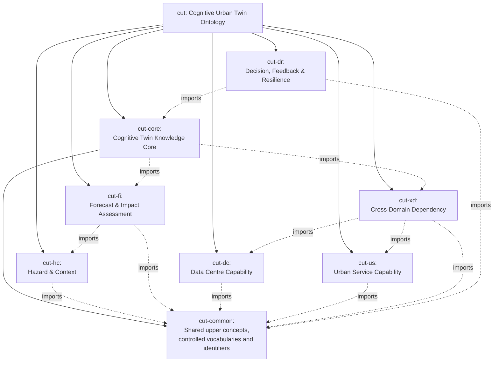

---

# Supplementary Figure S2 — Semantic Standards Alignment

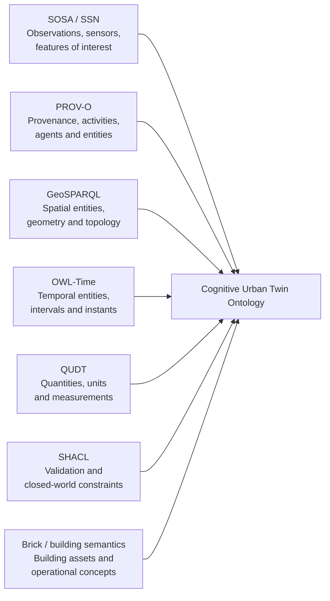

---

# Supplementary Figure S3 — Reasoning and Validation Pipeline

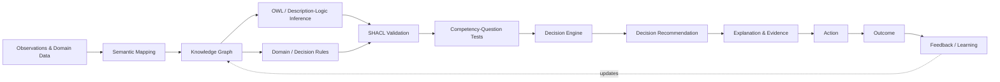

---

# Supplementary Figure S4 — Decision Traceability Chain

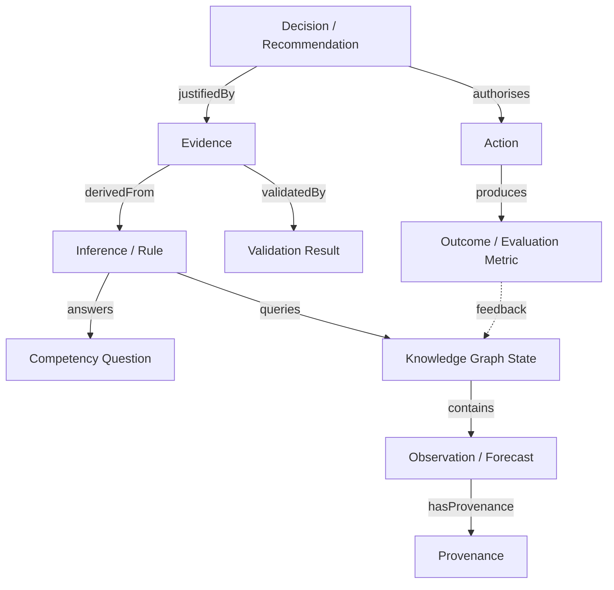

---

# Supplementary Figure S5 — Semantic Decision Traceability

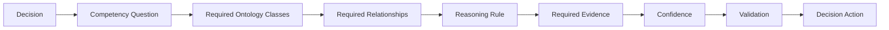

---

# Supplementary Figure S6 — Knowledge Lifecycle

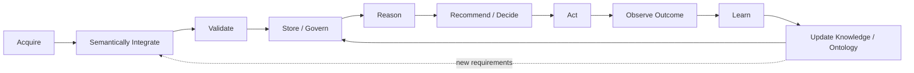

---

## Notes for publication use

1. Figures 4.1–4.8 use the same module numbering throughout.
2. Figure 4.4 is the canonical integrated class model.
3. Figure 4.5 should be used when the manuscript discusses explicit semantic object properties and cardinalities.
4. Figure 4.6 expresses the operational reasoning lifecycle rather than the static ontology structure.
5. Figure 4.7 is intentionally simpler than Figure 4.4 and should be used as the reader-facing class summary.
6. Figure 4.8 describes maturity of the ontology-enabled Cognitive Urban Twin, not generic digital-twin maturity.
7. The future OWL implementation should preserve the conceptual identities and relationships defined here while reusing established standards such as SOSA/SSN, PROV-O, GeoSPARQL, OWL-Time and QUDT where appropriate.
8. SHACL should be treated as the validation/assurance layer rather than as an inference language.
9. Mermaid is the publication-source representation; the OWL ontology should ultimately become the machine-executable semantic source of truth.
